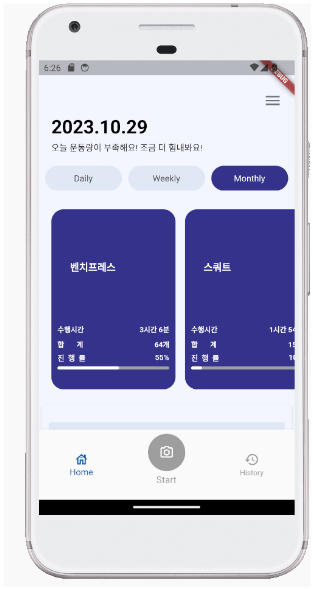
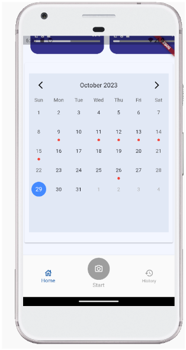
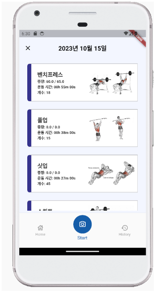
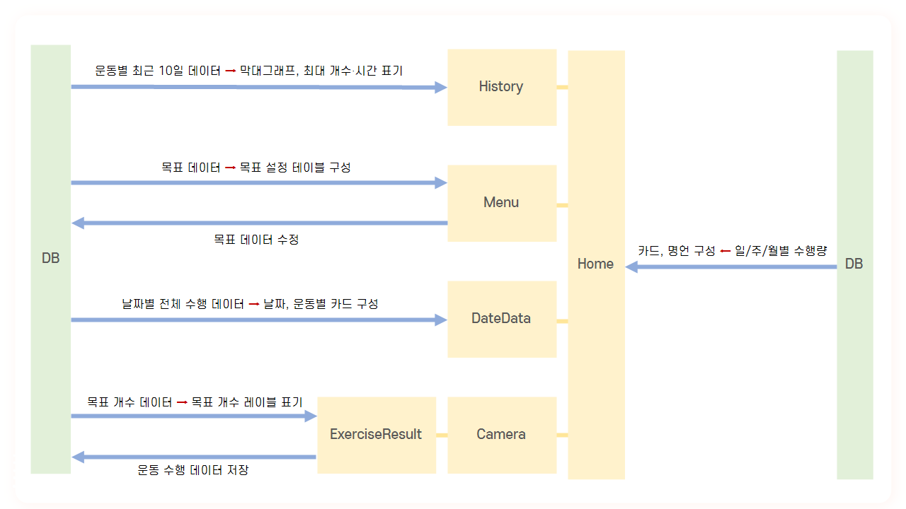
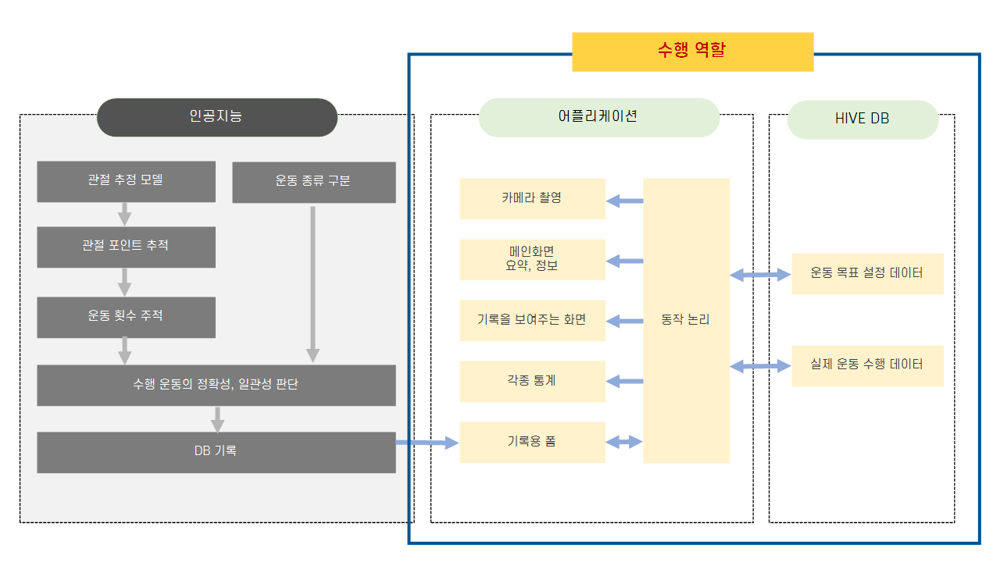

# 💪 MoveFit (스마트 헬스 케어 앱) 💪

 

## 🎉 프로젝트 개요

### 📅 개발 기간
2023년 4월 ~ 2023년 11월 (약 7개월)

### 🎯 목표
MoveFit은 홈트레이닝 시 주요 웨이트 트레이닝 자세를 촬영하여 빅데이터를 기반으로 자세를 평가하고, 목표 설정 및 운동 기록 관리 서비스를 제공하는 AI 운동 코치 앱을 개발했습니다.

### 🔧 기술 스택
- **프론트엔드:** Flutter
- **백엔드:** Python
- **데이터베이스:** HiveDB
- **AI 모델:** BlazePose, MoveNet a5
- **기타:** TensorFlow (머신러닝)

## 🌟 주요 기능
1. **자세 평가:** BlazePose 모델을 통해 촬영된 영상 속 사용자 신체의 관절 위치를 실시간 감지하고, MoveNet a5 모델로 운동 종류를 판별하여 정확한 운동 자세 평가.
2. **운동 목표 설정 및 기록 관리:** 사용자가 설정한 운동 목표(중량, 횟수)에 따라 일간/주간/월간 통계 제공.
3. **운동 수행 데이터 분석:** 각 운동별로 수축과 이완 지점을 데이터로 기록하고 분석하여 운동의 정확성과 일관성을 평가.
4. **DB 기록:** 사용자별 운동 수행 데이터(운동 종류, 중량, 횟수 등)를 DB에 저장하고, 통계 데이터를 시각화하여 제공.

## 📸 스크린샷

### 🌐 메인 화면

### 🔍 디테일 화면

## ⚙️ 개발 과정 흐름
1. **기획 및 설계:**
   - 사용자 요구사항 분석
   - 시스템 아키텍처 설계
   - 데이터베이스 설계
2. **프론트엔드 개발:**
   - Flutter를 이용한 앱 화면 설계 및 구현
   - UI/UX 디자인
3. **백엔드 개발:**
   - Python을 이용한 서버 개발
4. **AI 모델 통합:**
   - BlazePose 모델을 이용한 실시간 관절 추적
   - MoveNet a5 모델을 이용한 운동 종류 판별 및 데이터 분석

## 🤔 APP 동작 논리

## ✍️ 프로젝트 전체 요약

## ⚠️ 어려웠던 부분과 해결 과정

1. **APP과 DB 연결**:
   - 이전까지는 MySQL과 연동하여 데이터베이스를 관리했지만, 더 나은 성능을 위해 이번에는 HiveDB를 활용하여 시도해보았습니다.
처음에는 여러 참고자료를 통해 연결을 시도했지만, 데이터가 제대로 불러와지지 않아 큰 어려움을 겪었습니다. 
잠을 줄이고 팀원과 함께 끊임없이 문제를 분석하고 해결방안을 모색하는 시간을 가졌으며, 이 과정에서 많은 시행착오를 겪고 결국 3일 만에 데이터를 성공적으로 불러오는 문제를 해결할 수 있었습니다. 이 문제를 해결한 후에는 이전에 저장된 데이터를 수정하는 부분도 빠르게 해결했습니다. 완성된 코드는 생각보다 단순했지만, 이를 위해 팀원과 서로 다른 접근 방식을 제시하고, 피드백을 주고 받으며 문제를 해결해나가는 과정에서  팀워크를 향상시킬 수 있었습니다.

2. **프로젝트 완성을 위한 시간 부족**:
   - 프로젝트 진행 초기에 일정표를 세웠지만, 프로젝트의 최종 발표 일정이 10일 앞당겨짐에 따라 일정이 예정대로 흘러갈 수 없다는 어려움에 부딪혔습니다. 이러한 어려움을 극복하기 위해, 팀원과 각자의 작업 부분에서 발생한 오류를 공유했고, 전체 일정에 어떤 영향을 미치는지 살펴보았습니다. 이후, 핵심 기능과 부가 기능을 구분하여 프로젝트의 우선 순위를 재조정하였습니다. 이를 통해 프로젝트의 전체적인 진행 상황을 명확히 인식하고, 우선적으로 처리해야 할 작업에 집중할 수 있었습니다. 또한, 역할 분담을 더욱 명확히 하여 오류 해결에 필요한 시간을 줄이고, 작업의 진행 속도를 높이는 데 초점을 맞추었습니다. 이렇게 해서 예상치 못한 문제에도 효과적으로 대응하고, 프로젝트를 성공적으로 완성할 수 있었습니다.
 
